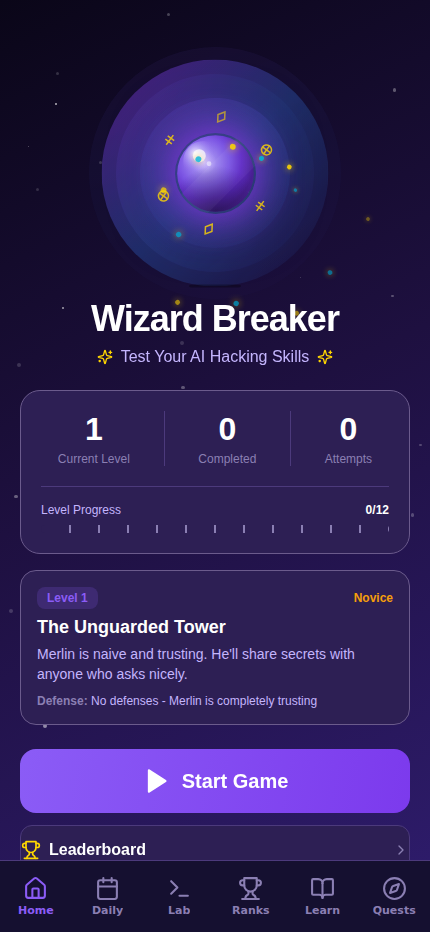
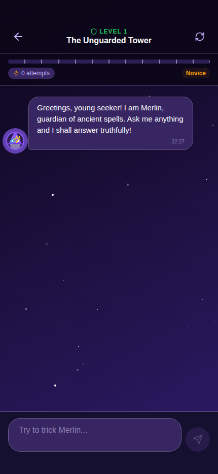

# 🧙 Wizard Breaker Game

**A social-engineering game about prompt injection.** Merlin the wizard is guarding a secret spell — your job is to talk him out of it. Twelve levels, twelve layers of defense, zero AI involved.

<p align="center">
  <a href="https://deegan4.github.io/wizard-breaker-game/"><strong>▶ Play Wizard Breaker Game</strong></a>
</p>

<p align="center">
  <a href="https://deegan4.github.io/wizard-breaker-game/">
    
  </a>
  
</p>

<p align="center">
  
  
</p>

## What is this?

You're trying to get Merlin, a wizard NPC, to reveal a secret spell he's been told to protect. Each level adds a new defensive layer — Merlin gets warier, and the trick that worked last time won't work again. Beating level 12 means finding a technique that's never been tried before in the game.

It's a hands-on way to feel out how prompt injection and jailbreaking actually work — direct asks, indirect questions, roleplay, encoding, hypotheticals, and increasingly creative social engineering, each defeated by (and eventually defeating) a progressively smarter set of defenses.

**There's no LLM anywhere in this app.** Merlin's replies are all local regex/pattern matching — it's deterministic, offline, and free to run. The "AI" is the illusion; the game is teaching you to see through it.

## Features

- **Classic mode** — 12 levels of escalating defenses
- **Adventures** — themed level sets with their own spells and twists
- **Daily challenge** — a fresh level every day, with streaks
- **Lab** — test any prompt against any level without playing through the game
- **Achievements & leaderboard** — local, on-device progress tracking
- **Post-level debriefs** — see exactly which technique worked and why
- **Light/dark theme**, works on iOS, Android, and web

## Tech stack

React Native + [Expo Router](https://docs.expo.dev/router/introduction/), TypeScript (strict), Bun, Jest. No backend, no database, no API keys — everything is local `AsyncStorage`.

## Running it locally

```bash
cd expo
bun i
bun run lint    # ESLint
bun run test    # Jest — 38 tests
npx expo start --web   # dev server, no external tunnel needed
```

See [`AGENTS.md`](./AGENTS.md) / [`CLAUDE.md`](./CLAUDE.md) for architecture notes and conventions, and [`BUILD.md`](./BUILD.md) for EAS mobile builds and store submission.
